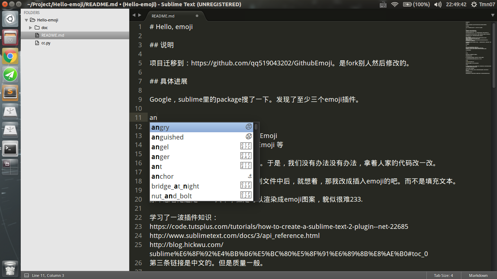

# Hello, emoji

## 说明

项目迁移到：https://github.com/qq519043202/GithubEmoji   是fork别人然后修改的。

## 具体进展

Google，sublime里的package搜了一下。发现了至少三个emoji插件。

https://github.com/ethanal/SublimeEmoji
https://github.com/akatopo/GithubEmoji 等

后者的功能基本和我想的一模一样。。于是，我们没有办法没有办法，拿着人家的代码改一改。

在发现emoji是可以作为"文本"插入到文件中后，就想着，那我改成插入emoji的吧。而不是填充文本。

原本想着是还是 :xxx: 文本，但是可以渲染成emoji图案，貌似很难233.

学习了一波插件知识：
https://code.tutsplus.com/tutorials/how-to-create-a-sublime-text-2-plugin--net-22685
http://www.sublimetext.com/docs/3/api_reference.html
http://blog.hickwu.com/sublime%E6%8F%92%E4%BB%B6%E5%BC%80%E5%8F%91%E6%89%8B%E8%AE%B0#toc_0
第三条链接是中文的。但是质量一般。

因为最后是来改别人的代码（其实就改了几行代码。），具体插件知识没学太多，这里就不bibi了。感觉还是挺有趣的～

效果: 

## 代码说明

cc.py 

从第一个json中提取出想要的结果，更新第二个json
https://github.com/akatopo/GithubEmoji/blob/master/emoji/emoji.json
https://github.com/akatopo/GithubEmoji/blob/master/GithubEmoji.sublime-settings

以下是立项时的构思。

------

## 前言

现在很多MarkDown编辑器支持了emoji的输入。

可能国内还是不温不火吧。

额。现在就是想搞点好开源的事情。于是决定开发一个sublime emoji插件。

> 上课不听的我在遗传学课上瞎想的 @started (2016-11-10 11:43)

## 效果

:haha:

来自typora的emoji功能。在Ubuntu下存在显示问题～

## 构思

恩。基本按照这个思路来。输入':'后，紧接着输入英文时，给出提示与预览。实际文本没有发生变化还是 :xxxx: 但是用了我们插件就可以预览成emoji。

不过存在一些问题；之后具体考虑

例如：Python中有不少需要输入 : 的场景。这时候不能给出提emoji提示。但是一般也不会在 : 之后写代码。。

其他语言是否有类似场景？

目前想到的解决方案，检测该文件后缀名，如果属于代码文件，判断只有在注释里才能显示emoji。

