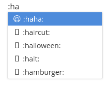

# Hello, emoji

## 前言

现在很多MarkDown编辑器支持了emoji的输入。

可能国内还是不温不火吧。

额。现在就是想搞点好开源的事情。于是决定开发一个sublime emoji插件。

> 上课不听的我在遗传学课上瞎想的 @started (2016-11-10 11:43)

## 效果

:haha:

来自typora的emoji功能。在Ubuntu下存在显示问题～

## 构思

恩。基本按照这个思路来。输入':'后，紧接着输入英文时，给出提示与预览。实际文本没有发生变化还是 :xxxx: 但是用了我们插件就可以预览成emoji。

不过存在一些问题；之后具体考虑

例如：Python中有不少需要输入 : 的场景。这时候不能给出提emoji提示。但是一般也不会在 : 之后写代码。。

其他语言是否有类似场景？

目前想到的解决方案，检测该文件后缀名，如果属于代码文件，判断只有在注释里才能显示emoji。

## HELP

求dalao助攻。orz